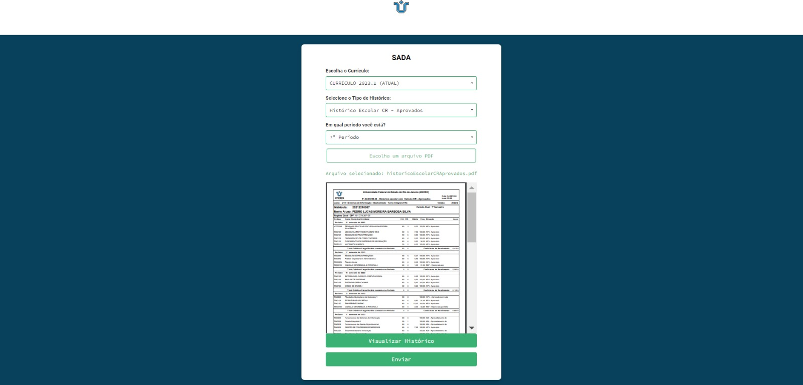
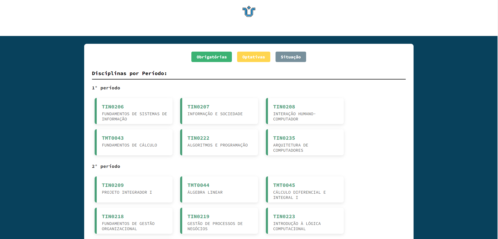

<div align="center">

  
  <h1>SADA</h1>
  
  <p>
    Sistema de Apoio ao Desempenho Acadêmico
  </p>
  
  
<!-- Badges -->
<p>
  <a href="https://github.com/powerandcontrol/SADA/graphs/contributors">
    
  </a>
  <a href="">
    
  </a>
  <a href="https://github.com/powerandcontrol/SADA/network/members">
    
  </a>
  <a href="https://github.com/powerandcontrol/SADA/stargazers">
    
  </a>
  <a href="https://github.com/powerandcontrol/SADA/issues/">
    
  </a>
  <a href="https://github.com/powerandcontrol/SADA/blob/master/LICENSE">
    
  </a>
</p>
   
<!--
<h4>
    <a href="https://github.com/Louis3797/awesome-readme-template/">View Demo</a>
  <span> · </span>
    <a href="https://github.com/Louis3797/awesome-readme-template">Documentation</a>
  <span> · </span>
    <a href="https://github.com/Louis3797/awesome-readme-template/issues/">Report Bug</a>
  <span> · </span>
    <a href="https://github.com/Louis3797/awesome-readme-template/issues/">Request Feature</a>
</h4>
-->

</div>

<!-- Sumário 
# 📔 Sumário

- [Sobre](#star2-sobre)
  * [Screenshots](#camera-screenshots)
  * [Tech Stack](#space_invader-tech-stack)
  * [Features](#dart-features)
  * [Color Reference](#art-color-reference)
  * [Environment Variables](#key-environment-variables)
- [Getting Started](#toolbox-getting-started)
  * [Prerequisites](#bangbang-prerequisites)
  * [Installation](#gear-installation)
  * [Running Tests](#test_tube-running-tests)
  * [Run Locally](#running-run-locally)
  * [Deployment](#triangular_flag_on_post-deployment)
- [Usage](#eyes-usage)
- [Roadmap](#compass-roadmap)
- [Contributing](#wave-contributing)
  * [Code of Conduct](#scroll-code-of-conduct)
- [FAQ](#grey_question-faq)
- [License](#warning-license)
- [Contact](#handshake-contact)
- [Acknowledgements](#gem-acknowledgements)


-->

<br>

## 🌟 Sobre

O SADA foi pensado e desenvolvido para auxiliar todos os estudantes do curso de <b>Sistemas de Informação da UNIRIO</b> que se sentem perdidos na hora de organizar a sua grade curricular.

O sistema analisa, a partir do Histórico do aluno, a situação do mesmo em cada matéria presente na grade curricular do curso. 

A partir da tela de visualização dessa análise, o aluno consegue facilmente encontrar as disciplinas que ele ainda não cursou e que estão disponíveis no período atual. Assim, facilitando a criação da grade de horários.

### 📷 Fotos do Website

#### 📃 Tela Inicial

<div align="center"> 
  
</div>

Ao abrir a tela inicial, o usuário deve preencher três inputs principais:

- <b>Currículo:</b> escolher entre o currículo antigo 2008.1 ou o atual 2023.2 (de acordo com a sua grade curricular atual)

- <b>Tipo do Histórico:</b> escolher qual tipo de histórico você baixou pelo Portal do Aluno (CR Aprovado ou Integralização)

- <b>Período:</b> escolher o período que você está cursando no período atual.

#### 📃 Tela de Obrigatórias

<div align="center"> 
  
</div>

Na tela de Obrigatórias, as disciplinas obrigatórias da Grade Curricular são classificadas em três status diferentes:

- <b>Cursadas:</b> matérias que o aluno já cursou, aparecem com a cor verde.

- <b>Não Cursadas e Disponíveis:</b> matérias que o aluno não cursou ainda e que ele já possui todos os pré-requisitos necessários para cursar,aparecem com a cor azul escuro.

- <b>Não Cursas e Indisponíveis:</b> matérias que o aluno não cursou ainda e que ele <b>não</b> possui todos os pré-requisitos necessários para cursar, aparecem com a cor vermelha.

<!-- TechStack -->
### 👾 Tecnologias Utilizadas

O SADA é uma solução web que utiliza `HTML`, `CSS` e `Javascript` para o Front-End da aplicação, enquanto o Back-End fica por conta do `Python` e do seu framework web `Flask`. 

O SGBD escolhido para fazer a criação e manutenção do Banco de Dados foi o `SQLite`, devido a sua integração com a biblioteca do Python `SQLAlchemy`.

#### Linguagens, Bibliotecas e Frameworks
<p>


</p>

### 🎯 Funcionalidades

- Upload de Histórico
- Análise de Progresso Curricular
- Visualização de dados

<!-- Color Reference -->
### 🎨 Paleta de Cores

| Cor             | Hex                                                                |
| ----------------- | ------------------------------------------------------------------ |
| Cor Principal |  #08415C |
| Cor Secundária |  #FFFFFF |
| Cor de Destaque |  #CC2936 |
| Text Color |  #000000 |

<br>

## 🖥️ Ambiente de desenvolvimento

### 🐍 Pré-Requisitos

Esse website é uma solução em Python, então antes de tudo é necessário baixar a linguagem de programação no <a href="https://www.python.org/downloads/"> site oficial </a>.

O segundo requisito necessário é o Git, que gerencia o controle de versionamento do projeto. Um tutorial de como instalar e começar a usar o Git pode ser encontrado no <a href="https://git-scm.com/downloads"> site oficial </a> da ferramenta.

### 🧰 Clonando o projeto

Tendo ambos os Pré-Requitos instalados no seu computador, você já consegue rodar o projeto localmente.

O primeiro passo é clonar o projeto na sua pasta de preferência.

```bash
git clone https://github.com/powerandcontrol/SADA.git
```

### 🔑 Ambiente virtual

Para rodar esse projeto você precisará criar um ambiente virtual `venv` dentro da pasta do SADA.

```bash
  cd SADA
  python -m venv venv
```

E, depois de criado, será necessário ativá-lo.

```bash
  venv\scripts\activate
```

### ⚙️ Instalando as Bibliotecas

As bibliotecas necessárias podem ser encontradas no arquivo `requirements.txt` e conseguimos baixar elas usando o gerenciador de pacotes `pip`.

```bash
  pip install -r requirements.txt
```
   
<!-- Running Tests -->
### 🧪 Rodando Localmente

Tendo seguido todos os passos anteriores você pode rodar o projeto sem maiores problemas usando o comando:

```bash
  python app.py
```

## 👋 Contribuidores

<a href="https://github.com/powerandcontrol/SADA/graphs/contributors">
  
</a>

<br>

## ⚠️ Licensa
Licensa MIT.
